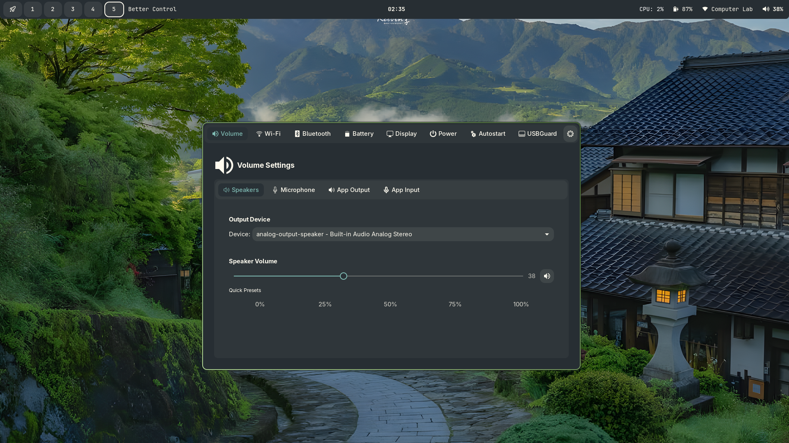

# Better-Bar


A sleek bar for BTDE

> [!NOTE]  
> This is still under development and may have noticeable bugs.


> [!WARNING]
> Planning on rewriting with better code management.

## Screenshot



### Prerequisites

- Rust (latest stable)
- GTK4
- libpulse (for volume control)
- NetworkManager
- D-Bus


### Building from Source

1. Clone the repository:

```bash
git clone https://github.com/better-ecosystem/better-bar
cd better-bar
```

2. Build and install:

```bash
cargo build --release
sudo cp target/release/better-bar /usr/local/bin/
```

### Running

To start the bar:

```bash
better-bar
```

### TODO

- [ ] Add extra modules and quick settings.
- [ ] Support sway workspaces

### In Progress

- [ ] Recator and organize widgets
- [ ] Add settings for the bar.

### Done

- [x] Workspace indicator (Hyprland)
- [x] Window title
- [x] Battery indicator
- [x] Network status
- [x] Volume control
- [x] CPU usage
- [x] Clock
